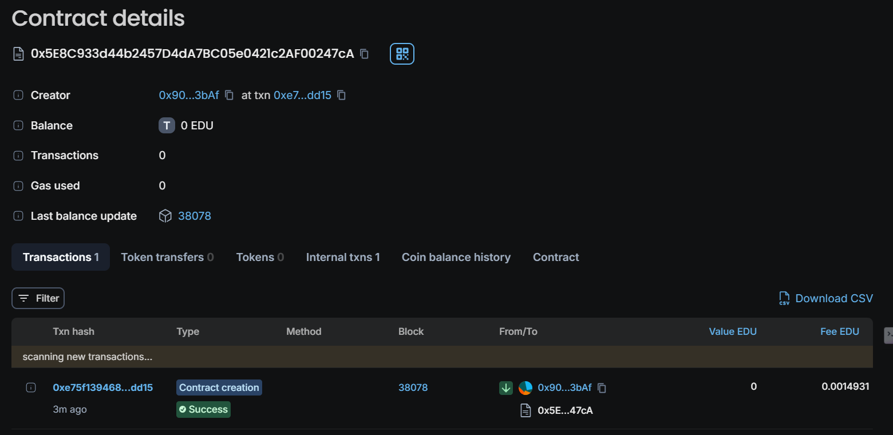

### README.md

# Internship Marketplace


## Vision

The Internship Marketplace is a decentralized platform designed to connect students with employers offering internships. By leveraging blockchain technology, we aim to create a transparent and secure system where students can apply for internships, employers can review applications, and stipends are paid out automatically based on predefined conditions. Our vision is to democratize access to internship opportunities globally, ensuring that students from all backgrounds can easily find and apply for internships without the need for intermediaries.

## Project Features

1. **Internship Posting:**
   - Employers can post internship opportunities, specifying details such as the company name, role, description, and stipend.
   
2. **Application Submission:**
   - Students can apply for internships by submitting their resume hashes, ensuring data privacy and security.

3. **Application Approval:**
   - Employers have the ability to review and approve applications. Only approved applications can proceed to the stipend payment stage.

4. **Stipend Payment:**
   - Employers can directly pay the stipend to approved students through the smart contract, ensuring timely and secure transactions.

5. **Internship Management:**
   - Employers can deactivate internships once they are filled or no longer available.

6. **Admin Control:**
   - The admin has special privileges to ensure the smooth operation of the platform, such as overriding certain functions if needed.

## Future Scope

1. **Decentralized Governance:**
   - Implement a decentralized governance model where stakeholders can vote on platform changes and regulations.
   
2. **Reputation System:**
   - Develop a reputation system for students and employers, based on their interactions and feedback, to ensure trust and reliability.

3. **Multi-Currency Support:**
   - Enable support for multiple cryptocurrencies, allowing for flexibility in stipend payments.

4. **Advanced Filtering and Search:**
   - Implement advanced filtering and search functionalities to help students find internships that best match their skills and interests.

5. **Integration with Educational Platforms:**
   - Integrate the marketplace with educational platforms to automatically verify student qualifications and streamline the application process.

6. **Global Outreach:**
   - Expand the platform's reach to include more countries, enabling students from different regions to access a broader range of internship opportunities.

## Project Structure

```
InternshipMarketplace/
│
├── contracts/
│   └── InternshipMarketplace.sol      # The main smart contract for the Internship Marketplace
│
├── migrations/
│   └── 1_deploy_contracts.js           # Migration script for deploying the smart contract
│
├── test/
│   └── InternshipMarketplace.test.js  # Test cases for the smart contract
│
├── README.md                          # Project documentation
│
├── truffle-config.js                  # Truffle configuration file
│
└── package.json                       # Node.js dependencies and scripts
```

## Developer Details

- **Name:** Sahitya Roy 
- **Email:** sahitya@risein.com


## Deployment 
Chain Name: Educhain Open Campus 
Contract Id: 0x5e8c933d44b2457d4da7bc05e0421c2af00247ca
  
